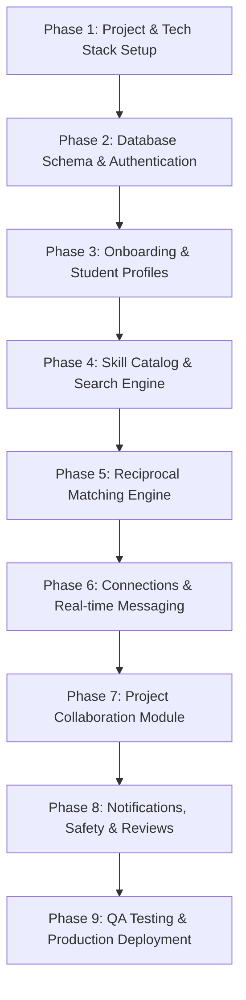

# STEX — Engineering Roadmap & Implementation Steps 🗺️

> **Sequential implementation guide for the STEX development team.**

---

## 📌 Implementation Flow Overview



---

## 📍 Phase 1: Environment & Project Setup

### Step 1.1 — Local Repository & Tooling Configuration
- Pull the latest repository structure (`PRD.md`, `README.md`, and `STEPS.md`).
- Add standard `.gitignore` file (`node_modules/`, `.env`, `.env.local`, `dist/`, `.DS_Store`).
- Configure code formatting and quality standards: `Prettier`, `ESLint`, and `Husky` pre-commit hooks.

### Step 1.2 — Tech Stack Initialization
- **Frontend**: Initialize Vite + React (JavaScript/TypeScript) with Tailwind CSS or Vanilla CSS design system tokens.
- **Backend/BaaS**: Provision Firebase Project (or Supabase / Node.js + Express backend).
- **Environment Variables**: Create `.env.example` containing template keys:
  ```env
  VITE_FIREBASE_API_KEY=your_api_key
  VITE_FIREBASE_AUTH_DOMAIN=your_auth_domain
  VITE_FIREBASE_PROJECT_ID=your_project_id
  ```

---

## 📍 Phase 2: Database Schema & Authentication

### Step 2.1 — Database Structure Setup
Set up the core data models in PostgreSQL / Firestore:

| Table / Collection | Core Fields |
| :--- | :--- |
| `users` | `user_id`, `name`, `email`, `college`, `course`, `year`, `bio`, `profile_image`, `created_at` |
| `skills` | `skill_id`, `skill_name`, `category` (*Programming, Design, Creative, Business, etc.*) |
| `user_skills` | `user_id`, `skill_id`, `type` (*`TEACH` \| `LEARN`*), `level` |
| `connections` | `connection_id`, `sender_id`, `receiver_id`, `status` (*`Pending` \| `Accepted` \| `Rejected` \| `Blocked`*), `message`, `created_at` |
| `messages` | `message_id`, `sender_id`, `receiver_id`, `message`, `attachment_url`, `read_status`, `created_at` |
| `projects` | `project_id`, `owner_id`, `title`, `description`, `team_size`, `current_members`, `status`, `created_at` |
| `project_members` | `project_id`, `user_id`, `role`, `status` (*`Applied` \| `Accepted` \| `Rejected`*), `joined_at` |

### Step 2.2 — Authentication Flow
- Create **Registration Screen** (Name, Email, Password, College, Course, Year).
- Create **Login & Password Reset Screens**.
- Implement a `Protected Area` layout wrapper to guard private routes.

---

## 📍 Phase 3: Onboarding & Profile Management

### Step 3.1 — Multi-Step Onboarding Wizard
Implement a 4-step post-registration onboarding UI:
1. **"What skills do you know?"** (Select tags: C++, Python, Photoshop, etc.).
2. **"What skills do you want to learn?"** (Select tags: React, UI/UX, ML, etc.).
3. **"What are your primary interests?"** (Coding, Design, Startups, Music, etc.).
4. **"What are you looking for?"** (Learn, Teach, Find Teammates, All).

### Step 3.2 — Student Profile Module
- **Public Profile View**: Hero section (Avatar, Name, College, Year, Bio), *Can Teach* (green pills), *Wants to Learn* (blue pills), Active Projects.
- **Profile Edit Modal**: Edit Bio, College details, Availability status (*Available*, *Busy*, *Weekends Only*).

---

## 📍 Phase 4: Skill Catalog & Search Engine

### Step 4.1 — Standardized Skill Catalog
- Pre-seed standard skill categories (*Programming*, *Web Dev*, *Design*, *Creative*, *Business*).
- Include custom skill suggestion input for new skills.

### Step 4.2 — Search & Filtering UI
- **Search Bar**: Debounced real-time search by skill name or student name.
- **Filter Sidebar**: Filter by College, Course, Skill Type (*Teaches* vs *Wants*), and Availability.
- **Student Card Grid**: Compact responsive cards displaying profile photo, skill tags, and a **Connect** CTA button.

---

## 📍 Phase 5: Reciprocal Matching Engine

### Step 5.1 — Compatibility Scoring Algorithm
Implement a match score calculation formula:
$$\text{Match Score} = w_1 \cdot \text{SkillMatch} + w_2 \cdot \text{LearningMatch} + w_3 \cdot \text{InterestMatch}$$

- Highlight **2-Way Reciprocal Matches**:
  > *Student A (Teaches Python, Wants UI/UX) $\longleftrightarrow$ Student B (Teaches UI/UX, Wants Python)*

### Step 5.2 — Dashboard Recommendations
- Display top 3–5 recommended student matches directly on the main student dashboard.

---

## 📍 Phase 6: Connection Request & Real-Time Messaging

### Step 6.1 — Connection Request System
- **Send Request Modal**: Add an optional introductory message.
- **Pending Requests Panel**: Accept, Reject, or Block options.

### Step 6.2 — Real-Time 1-on-1 Chat
- **Chat UI**: Active connections list, message history, input box, timestamps, and unread indicators.
- **Real-Time Integration**: Subscribe to `messages` using Firestore `onSnapshot` / Supabase Realtime / WebSocket.
- **Resource Attachment**: Allow sharing links (YouTube, GitHub, PDFs) within the chat window.

---

## 📍 Phase 7: Project Collaboration Module

### Step 7.1 — Project Creation & Discovery
- **Create Project Form**: Title, Description, Required Skills, Team Size limit.
- **Projects Explore Feed**: Project cards showing Owner, Description, Required Skills, Member count (e.g., `2/4`), and **Apply** button.

### Step 7.2 — Team Application Management
- **Applicant Review Dashboard**: Project owner can view applicant profiles and click **Accept** or **Reject**.
- **Team Workspace**: Basic workspace for accepted members to access project details and member contacts.

---

## 📍 Phase 8: Notifications, Safety & Feedback

### Step 8.1 — Notification System
- Bell icon dropdown & toast alerts for:
  - Connection Requests & Acceptance
  - New Messages
  - Project Applications & Approval

### Step 8.2 — Safety & Moderation
- **Report Modal**: Report inappropriate user profiles, messages, or projects with category selection.
- **Block User Action**: Instantly hide profile and prevent message delivery.

### Step 8.3 — Feedback & Reviews
- Post-exchange rating (1–5 Stars) and short text review on student profiles.

---

## 📍 Phase 9: Testing & Production Deployment

### Step 9.1 — QA & Cross-Device Verification
- Run E2E test of the primary user loop:
  $$\text{Register} \longrightarrow \text{Add Skills} \longrightarrow \text{Find Student} \longrightarrow \text{Connect} \longrightarrow \text{Chat}$$
- Verify responsive layout across Desktop, Tablet, and Mobile viewports.

### Step 9.2 — Production Deployment
- Deploy Frontend to **Vercel** / **Netlify**.
- Configure production Database security rules (Firebase Security Rules / PostgreSQL RLS).
