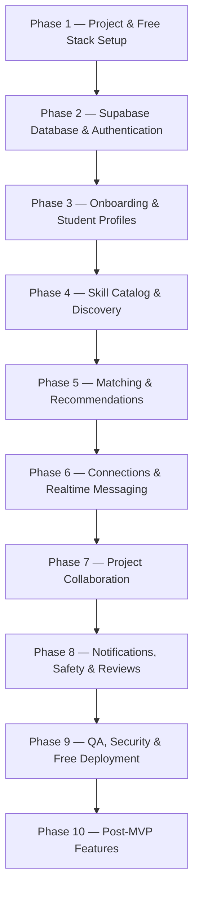

# STEX — Engineering Roadmap & Implementation Steps

## Official MVP Technology Stack

The STEX MVP stack is standardized on the following tools:

- **Frontend**: React
- **Build Tool**: Vite
- **Styling**: Tailwind CSS
- **Backend**: Supabase
  - **Database**: Supabase PostgreSQL
  - **Authentication**: Supabase Auth
  - **Realtime**: Supabase Realtime
  - **Storage**: Supabase Storage
  - **Security**: PostgreSQL RLS (Row Level Security)
- **Hosting**: Vercel Hobby OR Netlify Free
- **Repository**: GitHub
- **Development**: VS Code & Git

### Tech Stack Rationale
STEX features a relational data model involving users, profiles, skills, user-skill associations, connection requests, realtime messages, project listings, project skills, project members, reviews, notifications, and moderation reports. 

Standardizing on **Supabase (Supabase PostgreSQL + Supabase Auth + Supabase Realtime + Supabase Storage)** provides an integrated, unified relational backend out-of-the-box without requiring custom server maintenance or paid infrastructure.

---

## Free-Tier Rules

STEX is a student/college MVP designed to operate at **₹0/month**.

> **Free-Tier Limit Mandate:** The MVP must remain within the currently applicable free-tier limits of the selected services.

### Rules:
1. **Use Supabase Free**: Leverage Supabase Free Plan for database, authentication, realtime subscriptions, and file storage.
2. **Use Vercel Hobby OR Netlify Free**: Deploy the web frontend on free hosting tiers with automated continuous integration.
3. **Use GitHub Free**: Host code repositories and manage version control using GitHub Free features.
4. **Use Open-Source Libraries**: Restrict dependencies to open-source software (React, Vite, Tailwind CSS, `@supabase/supabase-js`, etc.).
5. **Do Not Use Paid AI APIs**: Do NOT introduce paid AI services (such as OpenAI, Anthropic, or paid LLM APIs) for MVP matching or features.
6. **Do Not Introduce Paid Infrastructure**: Do NOT use paid cloud infrastructure, paid databases, paid authentication services, paid file storage, paid email services, paid analytics services, paid UI component libraries, or paid domain names.
7. **Stay Within Quotas**: Stay strictly within free-tier database size, storage, bandwidth, and realtime concurrent connection limits.
8. **Never Commit Secrets**: Never commit environment variables, API credentials, secret keys, or service-role keys to GitHub.
9. **Approval Gate**: Any paid service requires explicit prior approval.
10. **Optimization First**: If a free-tier limit is reached, optimize the implementation first (e.g., query optimization, payload reduction, indexing, caching) and reduce unnecessary usage; do not automatically upgrade to a paid plan.

---

## Implementation Flow Overview



---

### Phase 1 — Project & Free Stack Setup

#### Step 1.1 — Git & GitHub Setup
- Initialize Git repository and link to GitHub remote repository (`yuvraj4codes/Stex_Skill`).
- Configure standard `.gitignore` file:
  ```text
  node_modules/
  dist/
  .env
  .env.local
  .DS_Store
  ```

#### Step 1.2 — Code Formatting & Tooling Configuration
- Configure standard code quality formatting with **Prettier** and linting rules with **ESLint**.

#### Step 1.3 — React + Vite + Tailwind CSS Initialization
- Initialize the React frontend application using Vite:
  ```bash
  npm create vite@latest stex-frontend -- --template react
  ```
- Install and configure **Tailwind CSS** for responsive component styling.

#### Step 1.4 — Supabase Client Setup & Environment Variables
- Install `@supabase/supabase-js` client library.
- Create `.env.example` template:
  ```env
  VITE_SUPABASE_URL=https://your-supabase-project.supabase.co
  VITE_SUPABASE_ANON_KEY=your_supabase_anon_key
  ```
- Create `.env` locally for development keys.

> 🚨 **SECURITY MANDATE:** NEVER expose the Supabase service-role key in frontend code. Never commit `.env`, secrets, private keys, or service-role keys to GitHub.

#### Step 1.5 — Free Hosting Linkage
- Connect the GitHub repository to **Vercel Hobby** OR **Netlify Free** for continuous deployment.

---

### Phase 2 — Supabase Database & Authentication

#### Step 2.1 — Supabase PostgreSQL Database Schema
Set up core relational tables in Supabase PostgreSQL:

1. **`profiles`**:
   - `id` (UUID, Primary Key, references `auth.users.id` ON DELETE CASCADE)
   - `full_name` (Text, NOT NULL)
   - `email` (Text, NOT NULL)
   - `college` (Text, NOT NULL)
   - `course` (Text, NOT NULL)
   - `year_semester` (Text, NOT NULL)
   - `bio` (Text)
   - `avatar_url` (Text)
   - `availability` (Text: *`Available`*, *`Busy`*, *`Weekends Only`*)
   - `looking_for` (Text: *`Learn`*, *`Teach`*, *`Find Teammates`*, *`Collaborate`*, *`All`*)
   - `created_at` (Timestamp with timezone, DEFAULT `now()`)

2. **`skills`**:
   - `id` (UUID, Primary Key, DEFAULT `gen_random_uuid()`)
   - `name` (Text, UNIQUE, NOT NULL — normalized lowercase/trimmed)
   - `category` (Text, NOT NULL: *`Programming`*, *`Web Development`*, *`Design`*, *`Creative`*, *`Business`*, *`Other`*)
   - `created_at` (Timestamp with timezone, DEFAULT `now()`)

3. **`user_skills`**:
   - `id` (UUID, Primary Key, DEFAULT `gen_random_uuid()`)
   - `user_id` (UUID, references `profiles.id` ON DELETE CASCADE)
   - `skill_id` (UUID, references `skills.id` ON DELETE CASCADE)
   - `type` (Text, NOT NULL: *`TEACH`* | *`LEARN`*)
   - `experience_level` (Text: *`Beginner`*, *`Intermediate`*, *`Advanced`*)
   - `created_at` (Timestamp with timezone, DEFAULT `now()`)

4. **`connections`**:
   - `id` (UUID, Primary Key, DEFAULT `gen_random_uuid()`)
   - `sender_id` (UUID, references `profiles.id` ON DELETE CASCADE)
   - `receiver_id` (UUID, references `profiles.id` ON DELETE CASCADE)
   - `status` (Text, NOT NULL: *`pending`*, *`accepted`*, *`rejected`*, *`blocked`*)
   - `intro_message` (Text)
   - `created_at` (Timestamp with timezone, DEFAULT `now()`)
   - *Constraint:* UNIQUE `(sender_id, receiver_id)`

5. **`messages`**:
   - `id` (UUID, Primary Key, DEFAULT `gen_random_uuid()`)
   - `sender_id` (UUID, references `profiles.id` ON DELETE CASCADE)
   - `receiver_id` (UUID, references `profiles.id` ON DELETE CASCADE)
   - `content` (Text, NOT NULL)
   - `attachment_url` (Text)
   - `is_read` (Boolean, DEFAULT `false`)
   - `created_at` (Timestamp with timezone, DEFAULT `now()`)

6. **`projects`**:
   - `id` (UUID, Primary Key, DEFAULT `gen_random_uuid()`)
   - `owner_id` (UUID, references `profiles.id` ON DELETE CASCADE)
   - `title` (Text, NOT NULL)
   - `description` (Text, NOT NULL)
   - `team_size` (Integer, NOT NULL)
   - `current_members` (Integer, DEFAULT `1`)
   - `status` (Text, NOT NULL: *`open`*, *`in_progress`*, *`completed`*)
   - `created_at` (Timestamp with timezone, DEFAULT `now()`)

7. **`project_skills`**:
   - `id` (UUID, Primary Key, DEFAULT `gen_random_uuid()`)
   - `project_id` (UUID, references `projects.id` ON DELETE CASCADE)
   - `skill_id` (UUID, references `skills.id` ON DELETE CASCADE)
   - `role_needed` (Text)

8. **`project_members`**:
   - `id` (UUID, Primary Key, DEFAULT `gen_random_uuid()`)
   - `project_id` (UUID, references `projects.id` ON DELETE CASCADE)
   - `user_id` (UUID, references `profiles.id` ON DELETE CASCADE)
   - `role` (Text)
   - `status` (Text, NOT NULL: *`applied`*, *`accepted`*, *`rejected`*)
   - `joined_at` (Timestamp with timezone, DEFAULT `now()`)

9. **`reviews`**:
   - `id` (UUID, Primary Key, DEFAULT `gen_random_uuid()`)
   - `reviewer_id` (UUID, references `profiles.id` ON DELETE CASCADE)
   - `reviewee_id` (UUID, references `profiles.id` ON DELETE CASCADE)
   - `rating` (Integer, CHECK `rating >= 1 AND rating <= 5`)
   - `comment` (Text)
   - `created_at` (Timestamp with timezone, DEFAULT `now()`)
   - *Constraint:* UNIQUE `(reviewer_id, reviewee_id)` to prevent duplicate reviews for the same interaction.

10. **`notifications`**:
    - `id` (UUID, Primary Key, DEFAULT `gen_random_uuid()`)
    - `user_id` (UUID, references `profiles.id` ON DELETE CASCADE)
    - `type` (Text, NOT NULL: *`connection_request`*, *`connection_accepted`*, *`new_message`*, *`project_application`*, *`project_accepted`*, *`project_rejected`*, *`project_invitation`*)
    - `title` (Text, NOT NULL)
    - `content` (Text, NOT NULL)
    - `link_url` (Text)
    - `is_read` (Boolean, DEFAULT `false`)
    - `created_at` (Timestamp with timezone, DEFAULT `now()`)

11. **`reports`**:
    - `id` (UUID, Primary Key, DEFAULT `gen_random_uuid()`)
    - `reporter_id` (UUID, references `profiles.id` ON DELETE CASCADE)
    - `target_type` (Text, NOT NULL: *`user`*, *`message`*, *`project`*)
    - `target_id` (UUID, NOT NULL)
    - `reason` (Text, NOT NULL)
    - `details` (Text)
    - `status` (Text, DEFAULT `'pending'`: *`pending`*, *`reviewed`*, *`dismissed`*)
    - `created_at` (Timestamp with timezone, DEFAULT `now()`)

---

#### Step 2.2 — PostgreSQL Row Level Security (RLS) Policies
Enable Row Level Security on all Supabase PostgreSQL tables:

- **`profiles`**:
  - Read: Allowed for authenticated users.
  - Write / Update: Users can edit only their own profile (`auth.uid() = id`).
- **`user_skills`**:
  - Read: Allowed for authenticated users.
  - Write / Delete: Users can manage their own skills (`auth.uid() = user_id`).
- **`connections`**:
  - Read: Users can access connections involving them (`auth.uid() = sender_id` OR `auth.uid() = receiver_id`).
  - Write: `auth.uid() = sender_id` for requests; receiver for status updates.
- **`messages`**:
  - Read / Insert: Users can only access messages they are authorized to access (`auth.uid() = sender_id` OR `auth.uid() = receiver_id`). Users cannot access messages of chats they are not part of.
- **`projects`**:
  - Read: Allowed for all authenticated users.
  - Write / Update: Project owners can manage their own projects (`auth.uid() = owner_id`).
- **`project_members`**:
  - Read: Project owner and team members.
  - Write: Applicant can apply (`auth.uid() = user_id`); owner accepts/rejects.
- **`reports`**:
  - Insert: Authenticated reporter (`auth.uid() = reporter_id`).
  - Read: Restricted so reports protect sensitive reporter information and do not expose them to reported targets.

Users cannot arbitrarily modify another user's records under any circumstance.

---

#### Step 2.3 — Authentication (Supabase Auth)
- **MVP Authentication Features**:
  - Email & Password registration
  - User Login & session management
  - Logout functionality
  - Password reset flow via Supabase Auth
  - Protected routes wrapper guarding private pages
- **Future Authentication (Post-MVP)**:
  - Google OAuth integration
  - College email verification (`@college.edu` / `@college.ac.in`)
  - Student ID card verification

---

### Phase 3 — Onboarding & Student Profiles

#### Step 3.1 — Registration & Onboarding Flow
Guided multi-step onboarding wizard collecting:
- Full name
- Email
- College
- Course
- Year/Semester
- Profile photo URL / avatar
- Bio
- Skills they know (Skills to Teach + experience level)
- Skills they want to learn
- Interests (Coding, Design, Web Dev, AI, Music, Startups, etc.)
- Availability (*Available*, *Busy*, *Weekends Only*)
- Purpose / Goals:
  - *Learn*
  - *Teach*
  - *Find project teammates*
  - *Collaborate*
  - *All*

#### Step 3.2 — Student Profile Module
Profile page display requirements:
- Profile photo / avatar
- Name
- College
- Course
- Year/Semester
- Bio
- Skills they teach (green tags)
- Skills they want to learn (blue tags)
- Interests
- Availability status indicator
- Projects participated in

---

### Phase 4 — Skill Catalog & Discovery

#### Step 4.1 — Standardized Skill Catalog
Standardized skill categories and default catalog:
- **Programming**: C, C++, Java, Python, JavaScript, React, HTML/CSS, SQL
- **Web Development**: HTML, CSS, React, Frontend, Backend
- **Design**: UI/UX, Figma, Photoshop, Illustrator, Canva
- **Creative**: Photography, Video Editing, Animation, Blender, Sketching
- **Business**: Marketing, Entrepreneurship, Finance, Presentation, Public Speaking
- **Other**: General skills

#### Duplicate Prevention:
Normalize all skill names to lowercase + trim to prevent duplicates such as:
- `JavaScript`
- `Javascript`
- `javascript`

Allow users to suggest new skills if a skill is missing from the catalog.

#### Step 4.2 — Discovery Engine & Filtering UI
Discovery supports finding:
- Students
- Skills
- Projects

Student filter options:
- Name search
- Skill filter (Teaches vs Wants to Learn)
- College name
- Course & Year/Semester
- Availability status
- Experience level
- Interests

---

### Phase 5 — Matching & Recommendations

#### Step 5.1 — Deterministic Compatibility Algorithm
The MVP matching engine must be simple, explainable, and deterministic, without requiring paid AI APIs.

#### Reciprocal Match Concept:
> **Student A**: TEACH → *Python*, LEARN → *UI/UX*  
> **Student B**: TEACH → *UI/UX*, LEARN → *Python*  
> ✨ **Result**: 2-Way Reciprocal Match!

#### Scoring Factors:
$$\text{Match Score} = w_1 \cdot \text{SkillMatch} + w_2 \cdot \text{LearningMatch} + w_3 \cdot \text{InterestMatch} + w_4 \cdot \text{ProjectMatch} + w_5 \cdot \text{AvailabilityMatch}$$

- **Skill Match**: Student B teaches what Student A wants to learn.
- **Learning Match**: Student A teaches what Student B wants to learn.
- **Interest Match**: Overlapping interest tags.
- **Project Match**: Matching required skills for open project listings.
- **Availability Match**: Compatible schedule status.

Do NOT add paid AI APIs for MVP matching. Advanced AI-driven matching is POST-MVP.

#### Step 5.2 — Dashboard Recommendations
Display approximately 3–5 relevant student recommendations with reciprocal match badges and relevant open projects directly on the student dashboard.

---

### Phase 6 — Connections & Realtime Messaging

#### Step 6.1 — Connection Request Flow
Connection lifecycle:
```text
Search Student ──> View Profile ──> Send Connection Request (with optional intro text)
      │
      └──> Accept / Reject ──> Connection Created ──> Chat Enabled
```

- **Actions**: Send Request, Accept, Reject, Block.
- **Validation**: Prevent duplicate pending connection requests between the same sender and receiver.

#### Step 6.2 — Realtime 1-on-1 Chat
- **Tech**: Powered by **Supabase Realtime** subscriptions on the `messages` table.
- **MVP Features**:
  - 1-to-1 direct text messaging
  - Message history
  - Timestamps
  - Unread message indicators
  - Optional: Online / active status
- **Resource Sharing**: Share YouTube links, GitHub links, website links, and text resources directly in chat.
- **Storage**: File uploads are optional and must stay within Supabase Free Plan storage limits.

> 🚫 **Exclusions**: Voice calls, video calls, group calls, and complex group chats are NOT MVP requirements.

---

### Phase 7 — Project Collaboration

Projects are a core STEX MVP feature.

#### Step 7.1 — Project Fields & Discovery
- **Project Fields**:
  - Title
  - Description
  - Required skills
  - Team size
  - Current members count
  - Status (*`open`*, *`in_progress`*, *`completed`*)

#### Example Project:
> **Title**: AI Attendance System  
> **Required Skills**: Python, Machine Learning, UI/UX  
> **Team Size**: 2/4  

- **Project Discovery Display**: Title, owner, description, required skills tags, team size, current members count, and an **Apply** button.

#### Step 7.2 — Application Flow & Team Workspace
- **Application Flow**:
  ```text
  Create Project ──> Add Required Skills ──> Publish ──> Student Discovers Project
        │
        └──> Student Applies ──> Owner Reviews ──> Accept / Reject ──> Team Created
  ```
- **MVP Team Workspace**:
  - Project description
  - Required skills list
  - Team members list
  - Member roles
  - Basic communication / contact linkage

Advanced task management, Kanban boards, and milestones are POST-MVP.

---

### Phase 8 — Notifications, Safety & Reviews

#### Step 8.1 — Notification System
Notifications for:
- Connection request received
- Connection accepted
- New direct message
- Project application received
- Project application acceptance / rejection
- Project team invitation

#### Step 8.2 — Safety & Moderation
- **Block User**: Blocked users must NOT be able to send connection requests, message the blocker, or interact with the blocker.
- **Report System**: Report user, report message, report project. Reports must protect sensitive reporter information.
- **Account Deletion**: Self-service account deletion.

#### Step 8.3 — Reviews & Feedback
- 1–5 star rating and short written review after interaction.
- Prevent duplicate reviews for the same interaction where possible.
- If reviews significantly delay the MVP, they may be deferred.

---

### Phase 9 — QA, Security & Free Deployment

#### Step 9.1 — Main Journey E2E Testing

1. **Main STEX Journey**:
   $$\text{Register} \longrightarrow \text{Create Profile} \longrightarrow \text{Add Skills} \longrightarrow \text{Find Student} \longrightarrow \text{Send Connection} \longrightarrow \text{Accept Connection} \longrightarrow \text{Chat} \longrightarrow \text{Exchange Knowledge}$$

2. **Project Journey**:
   $$\text{Create Project} \longrightarrow \text{Add Required Skills} \longrightarrow \text{Publish} \longrightarrow \text{Discover Project} \longrightarrow \text{Apply} \longrightarrow \text{Accept} \longrightarrow \text{Team Created}$$

#### Step 9.2 — Security & Responsive Testing
- **PostgreSQL RLS**: Audit RLS policies across all tables.
- **Protected Routes**: Verify route protection on unauthorized URL access.
- **Input Validation**: Ensure XSS-safe rendering for user-submitted text.
- **Secrets Audit**: Ensure no service-role key in frontend and no secrets committed to GitHub.
- **Responsive Testing**: Desktop, laptop, tablet, mobile.

#### Step 9.3 — Free Deployment
- Deploy frontend to **Vercel Hobby** OR **Netlify Free**.
- Link to **Supabase Free** backend.
- The application must remain usable within the applicable free-tier limits.

---

### Phase 10 — Post-MVP Features

> **Note:** These features are NOT required for the first MVP.

#### 1. COMMUNITY
- Student feed
- Q&A questions
- Skill-sharing posts
- Collaboration posts
- Achievements

#### 2. LEARNING SESSIONS
- Session creation
- Topic
- Duration
- Online / offline meeting link
- Participant registration

#### 3. ADVANCED PROJECTS
- Task assignment boards
- Progress tracking
- Milestones
- Project files repository
- Advanced team workspace

#### 4. AI
- Advanced AI matching
- AI learning assistant
- Personalized learning roadmaps

#### 5. GAMIFICATION
- XP (Experience Points)
- Badges
- Levels
- Achievements

#### 6. VERIFICATION
- Skill assessment quizzes
- Portfolio verification
- Peer endorsements
- College email & Student ID verification

#### 7. EXPANSION
- Android native app
- iOS native app
- Multiple colleges network
- College communities & partnerships
- Advanced admin analytics dashboard

---

## MVP Definition / Checklist

### AUTH
- [x] Register
- [x] Login
- [x] Logout
- [x] Password reset

### PROFILE
- [x] Student profile
- [x] Bio
- [x] College
- [x] Course / year
- [x] Skills I Know
- [x] Skills I Want

### DISCOVERY
- [x] Search students
- [x] Search skills
- [x] Filters
- [x] Student profiles

### MATCHING
- [x] Reciprocal matching
- [x] Recommended students

### CONNECTIONS
- [x] Send request
- [x] Accept / reject
- [x] Block

### COMMUNICATION
- [x] 1-to-1 messaging
- [x] Realtime messaging

### PROJECTS
- [x] Create project
- [x] Browse projects
- [x] Required skills
- [x] Apply
- [x] Accept / reject applicants

### NOTIFICATIONS
- [x] Connection notifications
- [x] Message notifications
- [x] Project notifications

### SAFETY
- [x] Report
- [x] Block
- [x] Account deletion

### DEPLOYMENT
- [x] Responsive UI
- [x] Supabase backend
- [x] Free hosting

---

## Final STEX MVP User Flow

```text
Student joins
     │
     ▼
Creates profile
     │
     ▼
Adds skills they know
     │
     ▼
Adds skills they want
     │
     ▼
Discovers students
     │
     ▼
Finds reciprocal match
     │
     ▼
Sends connection
     │
     ▼
Connects
     │
     ▼
Chats
     │
     ▼
Exchanges knowledge
     │
     ▼
Builds/joins project
     │
     ▼
Collaborates
     │
     ▼
Provides feedback
```

---

> **STEX — Learn. Teach. Connect. Build.**
